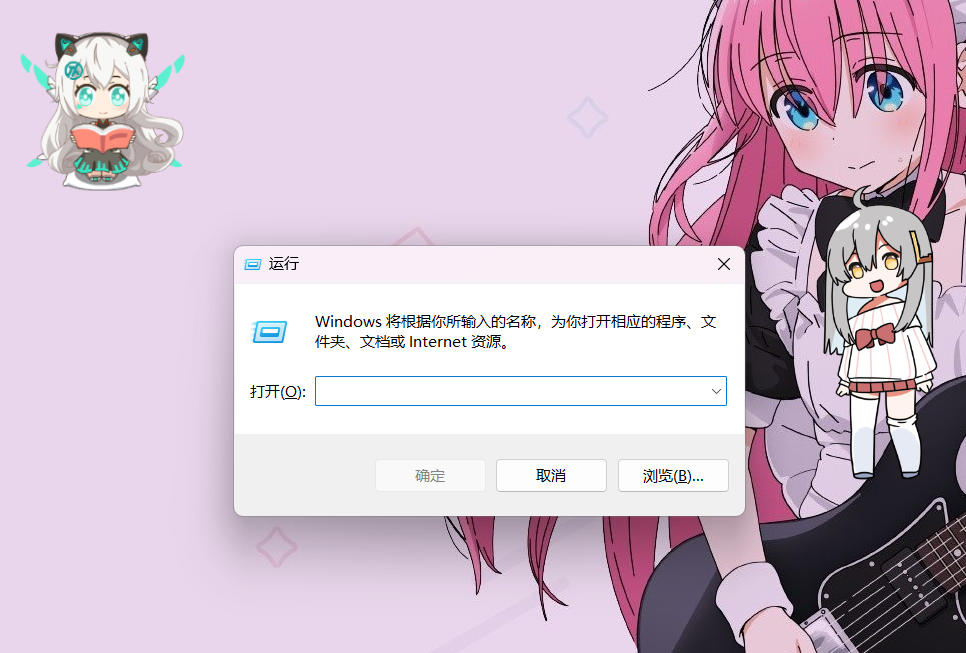

# 介绍

我们知道WINDOWS系统下`WIN+R`快捷键会呼出一个名叫“运行”的小窗口，它可以用于启动程序。
<!-- more -->

## 软件截图

## 解析

CLSID (Windows Class Identifiers): The Class ID, or CLSID, is a serial number that represents a unique ID for any application component in Windows. In practice, this means all registry entries for an application component can usually be found under the registry key HKEY_CLASSES_ROOT\CLSID\{CLSID value}.

CLSID简单的来说，这类系统程序不像`notepad.exe` `cmd.exe`等等，你可以理解为它们是一种“窗口”，一种特殊的文件夹，“寄宿”在资源管理器`EXPLORER.EXE`。

“运行”窗口就是这样的存在，除了快捷键呼出，你也可以在“开始”菜单中找到它的快捷方式，或者在资源管理器的地址栏中输入`Shell:::{2559a1f3-21d7-11d4-bdaf-00c04f60b9f0}`执行，或者CMD.EXE中执行`explorer.exe Shell:::{2559a1f3-21d7-11d4-bdaf-00c04f60b9f0}` 也可以呼出“运行”窗口。同理你也可以在“运行”窗口输入`Shell:::{2559a1f3-21d7-11d4-bdaf-00c04f60b9f0}`来呼唤它自己。

## 小技巧

通过“运行”窗口你可以方便找到那些常用的系统设置，这里我列举一些喜欢的：

| 命令 | 描述 |
|---|---|
| control | 控制面板（exe程序） |
| notepad | 记事本（exe程序） |
| wiaacmgr | 扫描仪程序（exe程序） |
| mmc | 管理控制台（exe程序） |
| diskmgmt.msc | 磁盘管理（mmc 子程序） |
| devmgmt.msc | 设备管理器（mmc 子程序） |
| lusrmgr.msc | 用户管理器（mmc 子程序） |
| ncpa.cpl | 网络连接（控制面板 子程序） |
| sysdm.cpl | 系统属性（PATH环境配置在这里） |

# 地址

这里有篇文章介绍了更多使用的命令： https://geekflare.com/windows-run-commands/